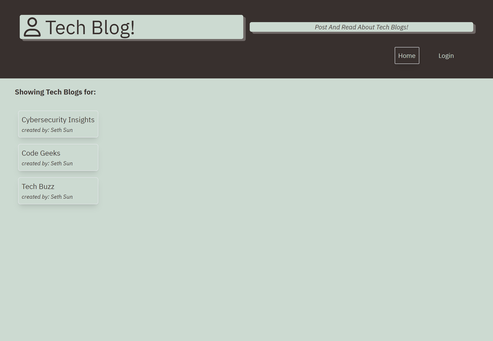
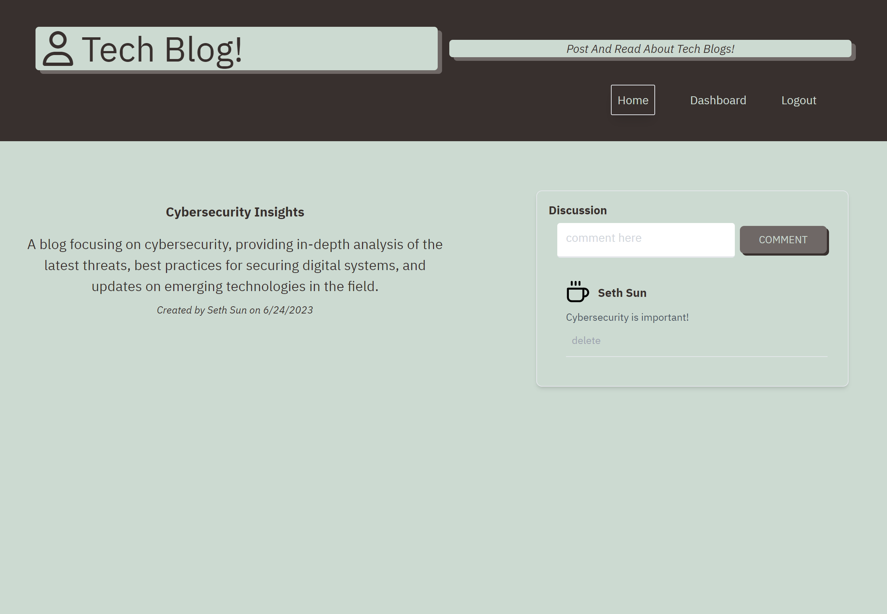
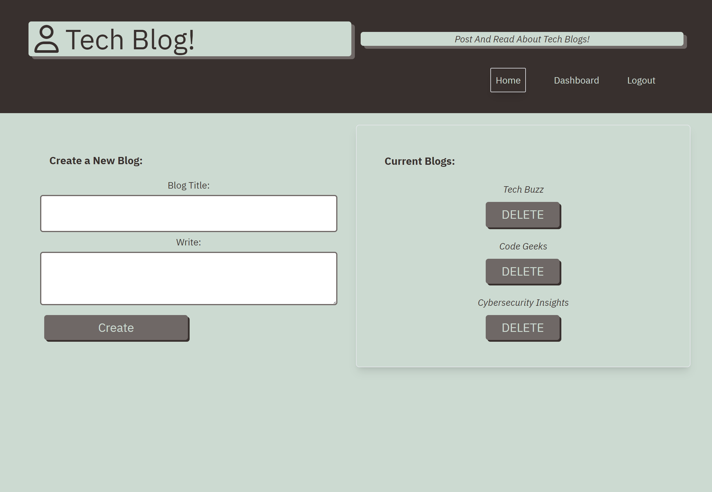
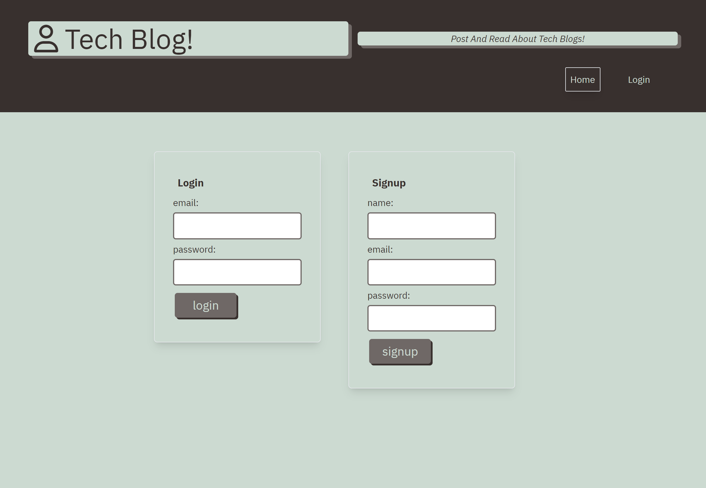

# Tech-Blog
  [](https://opensource.org/licenses/MIT)

Tech Blog allows users to create an account, access their dashboard to create a blog, and have their blog be featured in the frontpage. Engage with the community on recent blogs with the comment section and enjoy the user experience!

## Description
* Created an application using express, sequelize, mysql, bcrypt, handlebars, dotenv, tailwindCSS, and session-cookies.
* Used the CRUD method to be able to Create, Delete, and Request from MySQL database.
* Created Models that reference the user_id and pull from database information.
* Used Insomnia to test all routes.
* Used TailWindCSS for styling.

## Table of Contents
- [Installation](#installation)
- [Usage](#usage)

- [Screenshot/Video](#screenshotvideo)
- [Deployed APP](#deployed-application)
- [Contributing](#contributing)
- [License](#license)
- [Questions](#questions)

## Installation
* _To run the application on your local computer_:
> git clone repo-link-link

* _Run in terminal_:
> npm install

* _Load the MySQL database with_:
> mysql -u username -p

* _Source your Schema and create your tables_:
> source db/schema.sql;

* _Exit MySQL database and run in terminal to seed the data_:
> npm run seed

* _Once everything is seeded and database is loaded then you can start the server in the terminal with_:
> npm start

## Usage
User can locally run the application on their local computer or use the deployed link to test the features and start interacting with the application. To start the application locally you must have MySQL installed and ```add an .env file with the database name and mysql username and mysql password. Env database name will be journal_db.```


## Screenshot/Video







## Deployed Application
*A list of links of deployed applications*

- [Tech-Blog on deployed heroku](https://shielded-crag-55388-ba89262db419.herokuapp.com/)
- [Tech-Blog github repo](https://github.com/SithHun/tech-blog-post)

## Contributing
*A list of contributors on this project includes:*

* [Sith Hun](#github)


*Third-party applications used to create this project:*
* [bCrypt](#bcrypt)
* [Sequelize](#sequelize)
* [Connect-Session](#connect-session)
* [dotenv](#dotenv)
* [ExpressJS](#expressjs)
* [Handlebars](#handlebars)
* [Express-Session](#express-session)
* [MySQL2](#mysql2)
* [MySQL](#mysql)

## License
*This project is licensed under the MIT.*


## Questions
If you have any questions, you can reach out to me via GitHub: [@SithHun](https://github.com/SithHun)

Feel free to contact me via email: sithsun@gmail.com

<br>

> *Credits: This ReadMe was created with ❤️ by [Professional-ReadMe-Generator](https://github.com/SithHun/Professional-ReadMe-Generator)*
